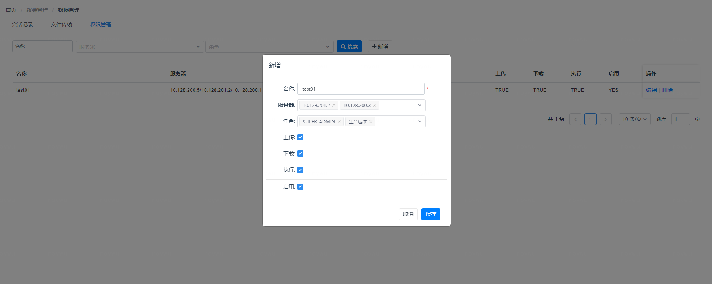
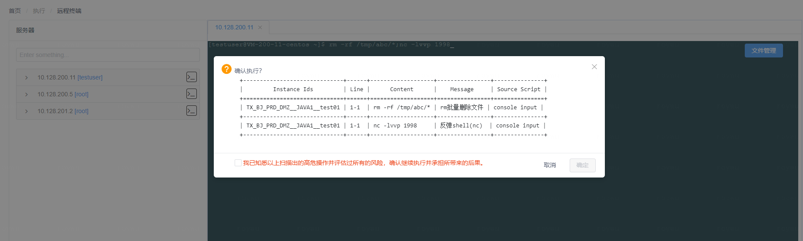
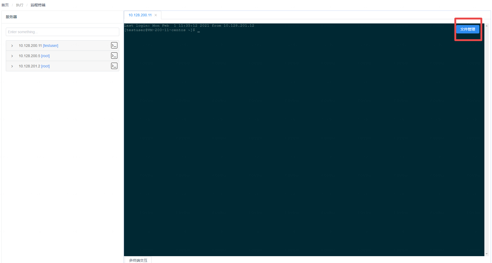
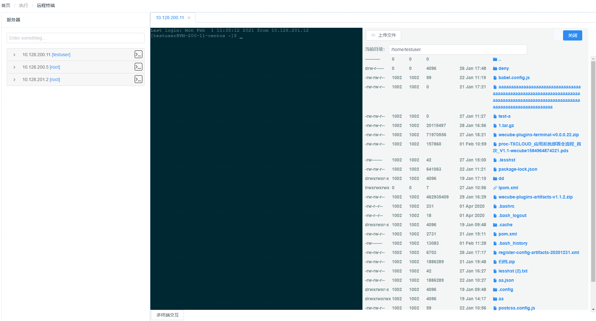

### 主要功能

1. 支持ssh连接登陆
2. 支持文件上传/下载
3. 支持连接 & 文件传输统一权限控制
4. 支持会话空闲回收
5. 支持文件传输记录 & 历史会话 审计
6. 支持实时终端输入的高危命令检测
7. 基于wecube表达式的主机收藏夹
8. 支持跳板机登陆

### 使用说明

**a) 系统参数**

需要修改插件的系统参数以正确启动插件服务

| 名称                             | 默认值                        | 描述                                                         |
| -------------------------------- | ----------------------------- | ------------------------------------------------------------ |
| TERMINAL_ASSET_TYPE              | wecmdb:host_resource_instance | 终端资产类型，比如cmdb插件中的主机资源，格式为package:entity |
| TERMINAL_FIELD_NAME              | name                          | 从TERMINAL_ASSET_TYPE数据中提取的名称字段                    |
| TERMINAL_FIELD_IP                | ip_address                    | 从TERMINAL_ASSET_TYPE数据中提取的登陆IP字段                  |
| TERMINAL_FIELD_PORT              | login_port                    | 从TERMINAL_ASSET_TYPE数据中提取的登陆端口字段                |
| TERMINAL_FIELD_USER              | user_name                     | 从TERMINAL_ASSET_TYPE数据中提取的登陆用户名字段              |
| TERMINAL_FIELD_PASSWORD          | user_password                 | 从TERMINAL_ASSET_TYPE数据中提取的登陆密码字段，支持qcloud/saltstack的\{cipher_a\}加密数据 |
| TERMINAL_FIELD_DESC              | description                   | 从TERMINAL_ASSET_TYPE数据中提取的描述字段                    |
| TERMINAL_SESSION_TIMEOUT         | 1800                          | 出于安全的考虑，会话不会长期有效，此变量控制一个会话在持续多少秒过程中如果用户无任何操作，服务器将主动断开会话连接 |
| TERMINAL_WEBSOCKET_URL           | ws://127.0.0.1:19002          | WebSocket连接地址，插件在19002端口注册了websocket服务，以提供ssh会话能力，请根据实际访问IP进行更改，格式为ws://IP:PORT。 |
| TERMINAL_COMMAND_CHECK           | ON                            | 是否启用终端实时高危命令检测，可选ON/OFF                     |
| TERMINAL_BOXES                   | all                           | 使用哪些高危命令插件的box进行命令检测，默认为all表示所有已启用的box，可以更改为box id列表，以","符号进行分隔，比如：1,2,3表示仅使用1/2/3这3个box进行检测。 |
| TERMINAL_FILE_DOWNLOAD_MAX_BYTES | 104857600                     | 出于安全的考虑，文件下载可以进行单个下载文件的大小限制，单位为byte，默认100MB |

至少需要修改TERMINAL_WEBSOCKET_URL参数才能正常使用插件。

**b) 配置权限**

菜单位置：系统-终端管理-权限管理

选择服务器和对应的使用角色

上传：是否允许角色对服务器进行文件上传

下载：是否允许角色对服务器进行文件下载，下载的单个文件大小受TERMINAL_FILE_DOWNLOAD_MAX_BYTES限制

执行：是否允许角色对服务器进行会话连接（决定执行-远程终端中服务器是否可见）

启用：是否启用本条配置

**c) 连接终端**

菜单位置：执行-远程终端

服务器在列表中即代表有执行权限，点击连接按钮进入终端会话

高危命令检测：若勾选并确认则命令会被发送到后端执行，取消则保留命令输入但不执行，用户可以根据提示进行命令修改再回车发送

需要进行文件上传下载时，点击文件管理

在文件管理中点击文件即下载，当没有上传权限时，上传文件按钮会被禁用

**d) 审计**

菜单位置：系统-终端管理-会话记录

可以针对用户的会话进行回放审计，用户对服务器的每个操作输入及输出均会被记录，审计记录存储为文件，位置在：/data/terminal/records/

菜单位置：系统-终端管理-文件传输

可以针对用户的文件传输记录进行审计

> version >= v0.2.0: 审计文件首先会被记录到本地/data/terminal/records/， session结束后会自动上传到wecube S3存储中