### 简介
Terraform插件为用户提供统一抽象的云服务定义，支持可扩展的多云管理。

#### 如何提供统一抽象的云服务定义？

资源服务被抽象为插件/接口/参数，通过这些抽象屏蔽不同云平台间的资源服务差异性，便于用户使用。

  - **插件**：对应一种资源服务，比如云主机，云磁盘，VPC等，插件服务可随时增加或删除以满足业务需求。
  - **接口**：目前Terraform插件提供apply，query，destroy接口，不支持自定义，分别对应操作：创建/更新资源，查询资源，销毁资源。
  - **参数**：接口正常工作所需的参数。
          固定输入参数：id/asset_id/provider_info/region_id，
          固定输出参数：id/asset_id
          固定输入参数不可更改，且对资源进行操作时必须提供
          其他参数为自定义参数，用户可根据具体的资源服务及操作(插件和接口)进行动态添加和删除
  - **模板**：模板用于定义通用枚举类型，比如云磁盘的磁盘类型有高效云磁盘，SSD云磁盘，我们可以统一抽象为EFFICIENCY & SSD
          而至于每个云上如何对应则在多云转换环节进行配置即可。

  通过以上抽象，我们可以为用户提供一个稳定 & 统一的云资源服务定义，而无需关心是在操作哪一个云平台。


#### 如何在多个云平台间实现平滑对接？

插件使用terraform进行多云管理，terraform提供了统一的资源文件定义规范，资源操作命令，插件需要完成根据统一抽象的内容到单一云平台的定义进行转换。

> 在配置terraform插件转换前，我们建议您可以通过[terraform官网](https://www.terraform.io/docs/cli/index.html)进行学习, terraform提供大量[provider](https://registry.terraform.io/)进行云平台的资源管理，您需要了解您即将使用的provider进行资源管理时所需要的参数以及对应的值


  **模板数据配置**：模板数据对应抽象模板，您需要根据统一的模板值进行每个云的对应值的配置。
               如： 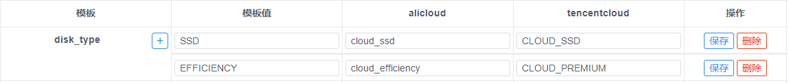

  **转化配置**：转化配置是针对一个云厂商 + （一个插件下的)一个接口进行配置，目的是将抽象的参数转换为特定云provider所需的字段，以及将抽象参数值转换为provider所需的值。

  **云厂商管理 & 认证配置**：云厂商对应terraform的provider，并针对云厂商配置AK/SK以便terraform使用。


### 插件定义

插件定义管理中我们推荐首先创建和配置Region和AZ资源的定义，然后再配置其他资源。

假设Region和AZ已经配置完成，现需要配置VPC资源

进入菜单：系统 - Terraform配置 - 插件定义

点击新增按钮


填写名称并点击确定

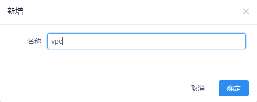

并依次添加接口：apply，query，destroy，添加接口后可以看到系统已为每个接口生成固定输入和输出参数。

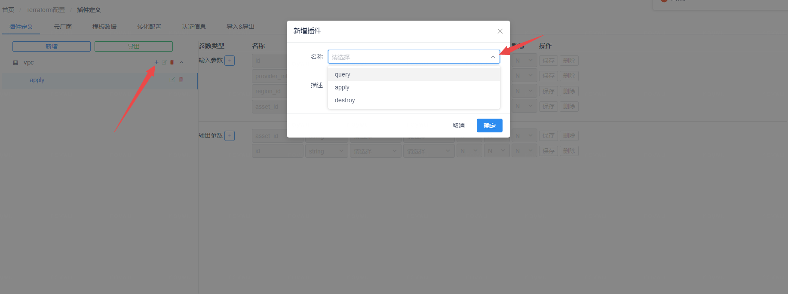

> 并不是每种资源都需要添加 apply，query，destroy 3个接口，具体需要参照您所管理的资源对象在terraform中的支持 或 业务需求 而定，比如在最佳实践中，Region服务我们只添加了apply和destroy，因为我们以Region为根设计了整体的接口服务(terraform中以Region为根)，所有的Region对象都是从外部源如CMDB中创建记录，并开始执行apply，所以不需要query。


#### 配置字段说明

名称：即字段名称

数据类型：支持string(字符串), object(JSON对象), int(数字)

模板：绑定一个抽象模板后可以限定输入参数的枚举类型

关联对象：输入数据可能是具有多层级结构的，这时我们需要知道这个字段从属的父属性对象参数以便解析数据(父属性也是在表格中的一个参数类型为object)。

多个: 是否将数据组织为列表形式

允许为空：是否允许参数值为空(null)

敏感：是否需要对字段值进行加密脱敏


#### Apply接口配置

> 准备工作：配置apply接口前，您需要提前进行vpc抽象设计：创建VPC资源都需要名称，CIDR，标签，并确定这些信息是较多provider云厂商的共同特征。

我们在固定输入参数的基础上添加name，cidr，tags（因为固定参数提供了region_id信息，所以无需额外添加region参数），填写完成后保存参数

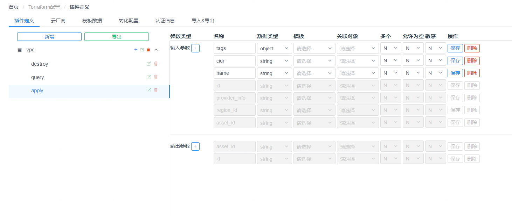

#### Query接口配置

> 准备工作：配置query接口前，您需要了解业务上本类资源会以什么条件作为查询，通常您不需要全部配置到插件中，假设我们目标是支持根据region_id或vpc的资产id进行查询，那么默认的固定输入参数就已足够，无需添加更多输入参数。再比如我们添加子网Subnet插件的query接口时，根据业务需要：以vpc_id或az_id进行查询，那么就添加vpc_id和az_id 2个参数即可。

假设我们只需要查询region下的所有vpc资源，那么默认参数中已经包含了所需的参数，所以输入参数无需配置

输出参数中，我们根据需要添加name，cidr，tags , region_id 4个参数

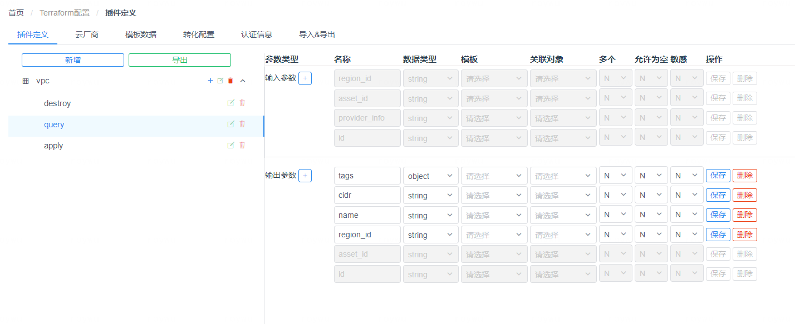

#### Destroy接口配置

destroy接口无需配置，插件默认即可用。


### 云厂商

进入菜单：系统 - Terraform配置 - 云厂商

云厂商对应terraform的provider，请按照以下步骤进行添加：

#### 收集Provider信息

收集provider所在的命名空间以及region和ak/sk属性的命名

进入[provider搜索页面](https://registry.terraform.io/)，找到您需要的provider

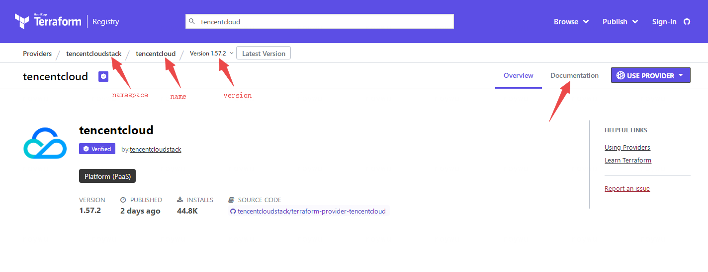

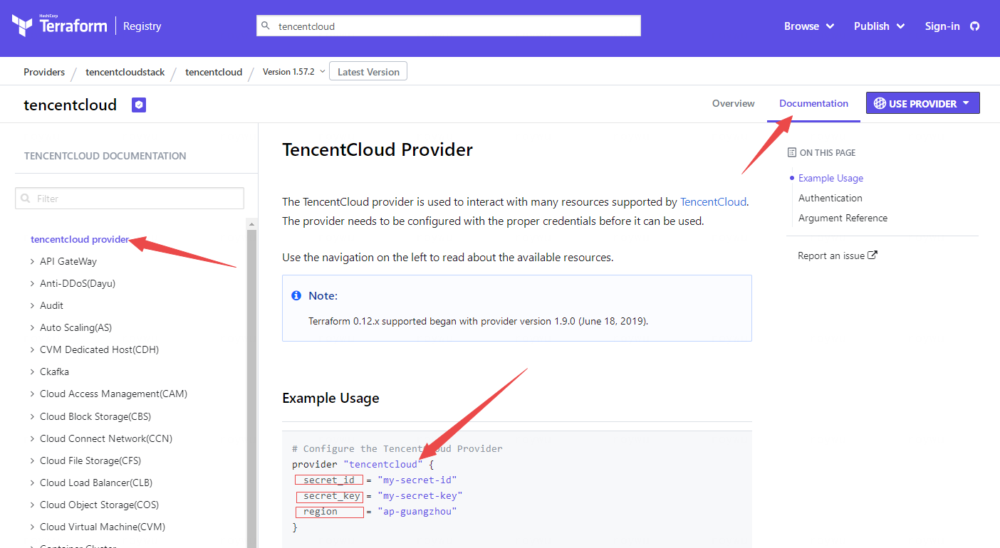


#### 获取Provider

并在一个可以联网的环境上使用terraform init下载provider到本地（需是linux_amd64架构的provider）

比如tencentcloud的provider：

```bash
cat > provider.tf.json << EOF
{
    "terraform":{
        "required_providers":{
            "tencentcloud":{                                  # name
                "source":"tencentcloudstack/tencentcloud",    # namespace / name
                "version":"1.157.0"                           # version
            }
        }
    }
}
EOF
terraform init && ls -al
```

您可以在当前目录下找到.terraform 目录，需要找到其provider可执行文件 和 .terraform.lock.hcl文件，并按照以下格式重新进行组织

```text
└── tencentcloud
    └── 1.57.0
        ├── linux_amd64
        │   └── terraform-provider-tencentcloud_v1.57.0
        └── linux_amd64_hcl
            └── .terraform.lock.hcl
```

最后把tencentcloud文件夹复制到docker主机上的${wecube_data}/terraform/providers/目录下即可

> terraform插件默认自带了tencentcloud和alicloud的2个provider文件，如果是使用wecube最佳实践默认已经注册到云厂商中，如果您希望手动管理，可以根据以下信息添加Provider到插件即可：
>
> aliyun/alicloud    1.128.0
>
> tencentcloudstack/tencentcloud       1.56.15

#### 添加Provider到插件

在web页面中添加云厂商信息

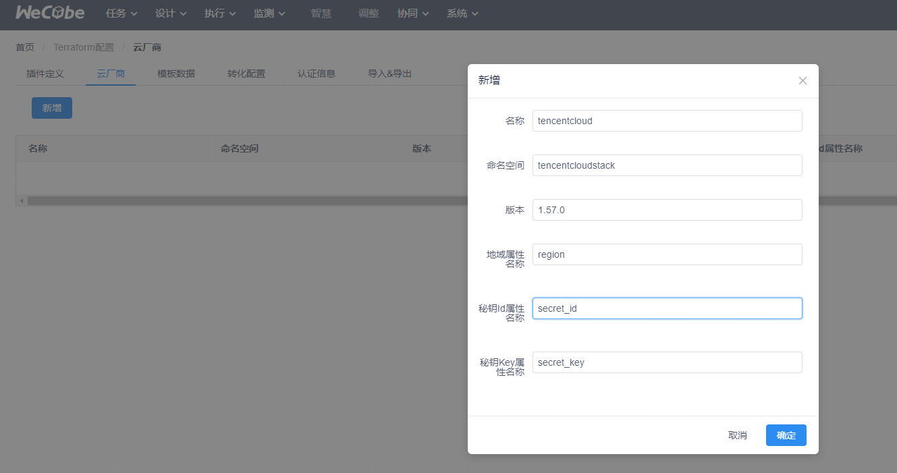

有两种方式可以添加 Provider
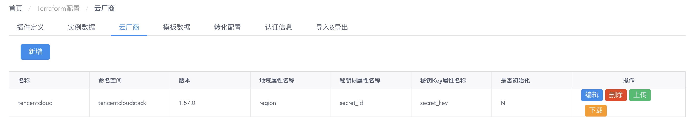
1. 连网场景，通过点击 "下载" 按钮，直接下载官方提供的 Provider 文件
2. 离线场景，通过点击 "上传" 按钮，上传本地制作的 Provider 文件
```
本地制作 Provider 文件流程如下：
（1）根据上面"获取Provider"步骤，找到其provider可执行文件 terraform-provider-tencentcloud_v1.57.0 和 .terraform.lock.hcl文件，并放入临时目录 tmpdir
（2）cd tmpdir/
（3）mkdir -p .terraform/providers/registry.terraform.io/tencentcloudstack/tencentcloud/1.57.0/linux_amd64/
（4）mv terraform-provider-tencentcloud_v1.57.0 .terraform/providers/registry.terraform.io/tencentcloudstack/tencentcloud/1.57.0/linux_amd64/
（5）zip -r tencentcloud_v1.57.0.zip .terraform .terraform.lock.hcl
```

### 模板数据

进入菜单：系统 - Terraform配置 - 模板数据

根据前面的操作，我们可以知道插件接口输入参数中可以创建和绑定一个模板，但每个云厂商对应的模板值是不同的，因此我们需要对每个云进行模板数据配置

1.  为模板添加抽象模板值，比如EFFICIENCY，SSD
2. 为每个抽象模板值填写对应的云厂商具体值，比如alicloud中SSD对应cloud_ssd


### 转化配置

进入菜单：系统 - Terraform配置 - 转化配置

插件的一个接口转化为terraform的多个resource或datasource资源，每个resource或datasource都有Argument(输入参数)和Attribute(输出参数)，简称Arg，Attr

- 一个接口对应一个resource的场景，直接配置接口参数到resource参数的转换即可

- 一个接口对应多个resource的场景，比如购买NAT网关后创建网关与多个EIP的绑定，这在云provider上表示为2个资源nat_gateway和nat_eip_association，此时应当在转换配置上增加2个source，分别为nat_gateway和nat_eip_association，nat_eip_association的Argument则必须声明一行名称为ROOT的记录，用于判定nat_eip_association资源的行数，然后使用其他一个或多个参数组成关键参数用于判定资源是否为同一个，比如nat_id与eip_id组成关键参数，用于判定旧的关联是否需要删除，当前资源是否新增或更新。如下图所示

    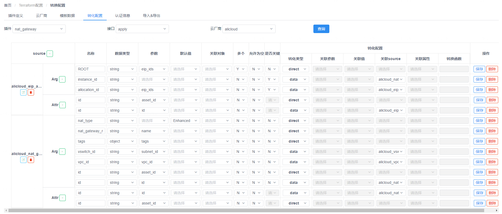

#### 配置字段说明

source：用于管理resource和data_source资源

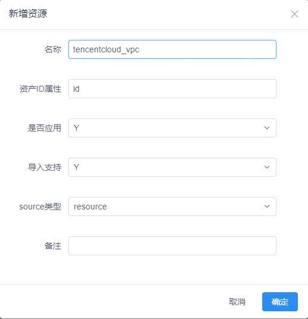

名称：即字段名称，插件预留ROOT关键名称，用于判定多资源时的资源行数。

数据类型：支持string(字符串), object(JSON对象), int(数字)

参数：Argument时绑定参数意味着本字段的值从参数中获取并进行转换处理，Attribute时绑定参数意味着从输出tfstate的相应字段值进行转换处理后赋予参数

默认值：若没有参数或转换为空，则使用默认值

关联对象: 输入数据可能是具有多层级结构的，这时我们需要知道这个字段从属的父属性对象参数以便解析数据(父属性也是在表格中的一个参数类型为object)。

多个：是否将数据组织为列表形式

允许为空：是否允许参数值为空(null)

是否关键：关键字段用于判定是否相同资源

转化类型：将数据进行一定的逻辑转换，以满足云厂商输入要求 或 输出要求，常见的转换有模板转换：输入时从抽象SSD 转化为 cloud_ssd，输出时从cloud_ssd 转化为 SSD值。

| 类型              | 名称           | 描述                                                         |
| ----------------- | -------------- | ------------------------------------------------------------ |
| direct            | 直接转换       | 即直接将输入值作为输出                                       |
| data              | ID映射转换     | Argument使用时要求当前参数为源id值，输出为云资产id值；<br/>Attribute要求当前字段为云资产id值，输出为源id值； |
| attribute         | 属性转换       | Argument使用时要求当前参数为源id值，输出为对应源id的云资产某个属性的值；<br/>Attribute要求当前字段为云资产某个属性的值，输出转换为源id值； |
| template          | 模板转换       | 根据模板定义进行转换，若值在模板中未定义会触发报错。         |
| context_dircect   | 条件直接转换   | 前置判断条件的direct转换，当某个参数的值等于设定值时(必须绑定template)，进行direct转换处理，否则字段不会出现在tfjson定义文件中 |
| context_template  | 条件模板转换   | 前置判断条件的template转换，当某个参数的值等于设定值时(必须绑定template)，进行template转换处理，否则字段不会出现在tfjson定义文件中 |
| context_data      | 条件ID映射转换 | 前置判断条件的data转换，当某个参数的值等于设定值时(必须绑定template)，进行data转换处理，否则字段不会出现在tfjson定义文件中 |
| context_attribute | 条件属性转换   | 前置判断条件的attribute转换，当某个参数的值等于设定值时(必须绑定template)，进行attribute转换处理，否则字段不会出现在tfjson定义文件中 |
| function          | 函数转换       | 内置了remove，split，replace，regx等函数的支持<br/>remove：从键值对(对象)中移除key<br/>                  例如：{"function":"remove","args":{"keys":["resource_group"]},"return":"result"}<br/>split: 用特定字符对字符串进行切割并取出第N个结果<br/>          例如：{"function":"split","args":{"splitChar":["#"]},"return":"result[1]"}<br/>replace：从键值对(对象)中移除key<br/>                  例如：{"function":"replace","args":{"replaceVal":[{"oldVal":"newVal"}]},"return":"result"}<br/>regx: 用特定字符对字符串进行切割并取出第N个结果<br/>          例如：{"function":"regx","args":{"regExp":["(\\d+).(\\d+).(\\d+).(\\d+)"]},"return":"result[0]"} |

关联参数：当转化类型为context_xxxxx时，用于指定前置判断条件的参数

关联值：当转化类型为context_xxxxx时，用于指定前置判断条件的参数对应的模板值

关联source：当转化类型为data/context_data/attribute/context_attribute时，用于指定当前id转换为哪一种source资源

关联属性：当转化类型为attribute/context_attribute时，用于指定当前id转换为source资源的哪一个属性

转换函数：用于定义转换函数和函数的转换具体规则

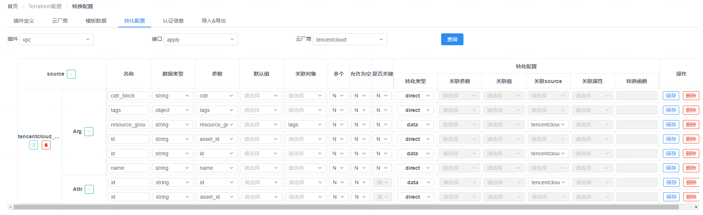

### 认证信息

进入菜单：系统 - Terraform配置 - 认证信息

配置云厂商的认证信息，需要您申请账号的AK/SK，然后在页面中进行配置。

认证名称唯一，每次使用插件的接口时，都需要传递认证的名称进行云平台的操作。

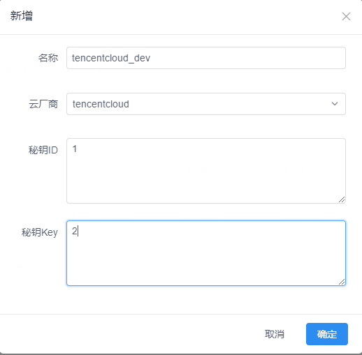

插件会对AK/SK进行加密存储

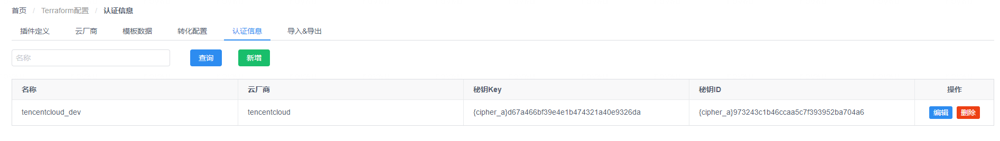

### 导入导出

进入菜单：系统 - Terraform配置 - 导入导出

每个插件的转换配置和模板数据配置，均可以导出和导入，导出数据不包含任何认证相关数据，便于共享和复用您当前的配置信息。

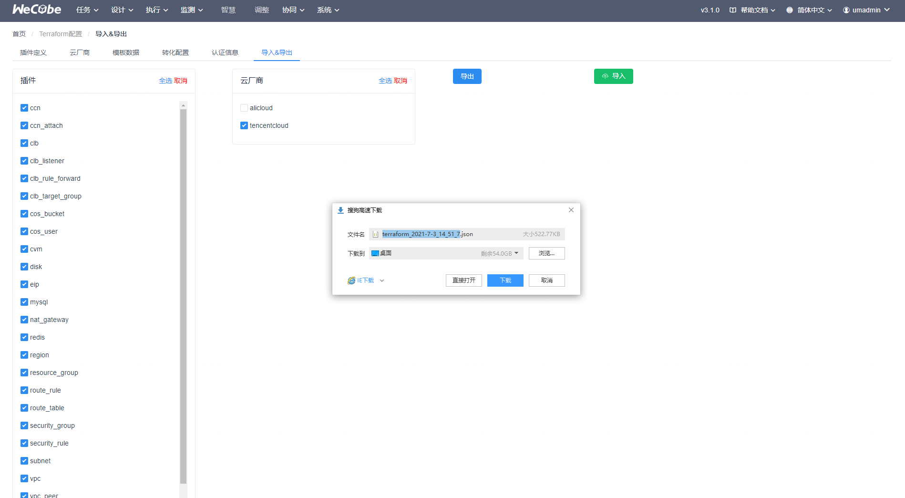

### 配置调试

进入菜单：系统 - Terraform配置调试

插件的配置过程中您需要参考terraform的provider官方文档，且其中的字段使用说明可能不够详细，经常需要配置完成后调试进行确认，所以插件为您提供了调试页面

#### 调试数据

用于显示调试过程中资源id，源id，及其所在Region，terraform的输入tfjson和tfstate数据，便于您观察历史的调试信息，且区分于平台正式的调用数据，互不干扰。

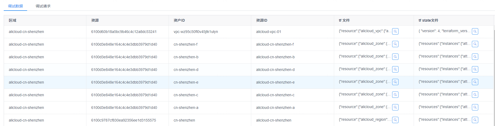

#### 调试请求

用于模拟插件的接口请求，每一次请求，都会记录到调试数据中，并且返回当前调试过程中的明细数据

> 如果您使用的是wecube提供的最佳实践配置，那么在每次apply资源之前，请确认所使用的region和zone都已经apply
>
> 比如首次apply的正确顺序：region - zone - vpc - subnet - ...，因vpc依赖于region资源，subnet依赖于vpc和zone资源

调试报文格式如下：

```
{
    "requestId": "vpc-apply01",
    "operator": "admin",
    "inputs": [
        {
            "confirmToken": "",
            "callbackParameter": "vpc-01",
            "id": "vpc-01",
            "region_id": "ap-guangzhou",
            "asset_id": "",
            "name": "vpc01",
            "cidr": "10.20.0.0/16",
            "tags": {
                "project": "test"
            },
            "provider_info": "tencentcloud_dev"
        }
    ]
}
```

requestId: 代表每次请求的唯一标识

operator：代表操作用户，不需要修改

inputs.confirmToken: 默认提供空字符串值即可，若插件执行返回需要确认，您确认后仍需要执行，请将本字段值置为"Y"

inputs.callbackParameter: 模拟WeCube平台请求的字段，与id字段相同即可

inputs.其他字段：其他字段来源于您声明的插件接口的字段，比如示例中的数据即插件VPC的apply接口所声明的字段

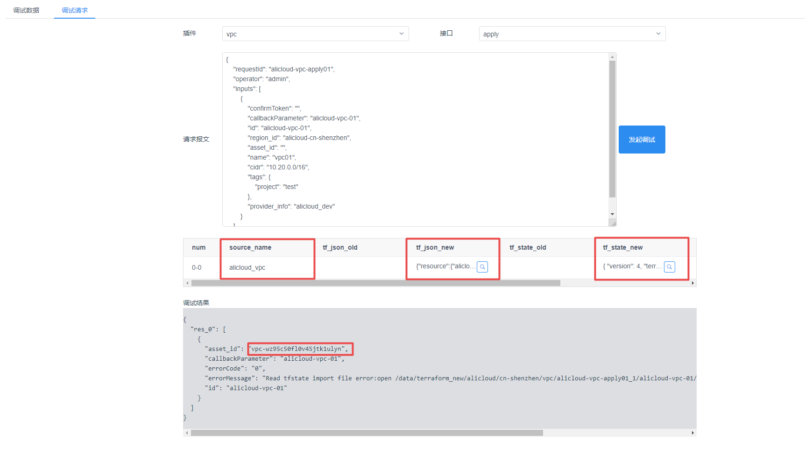
