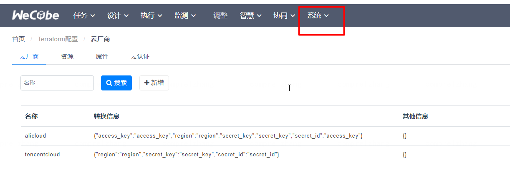
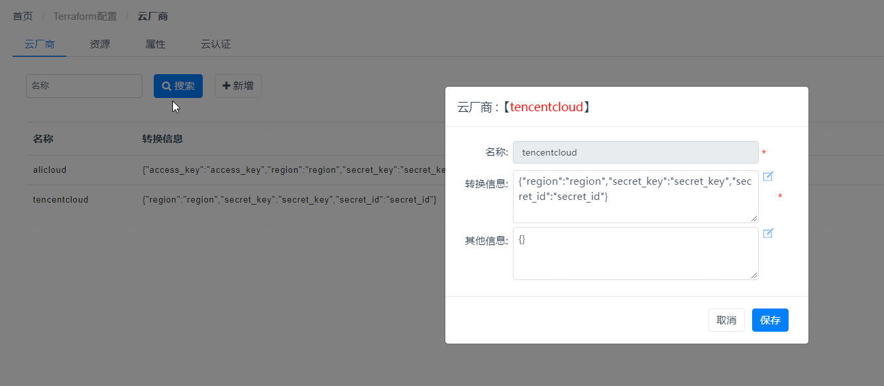
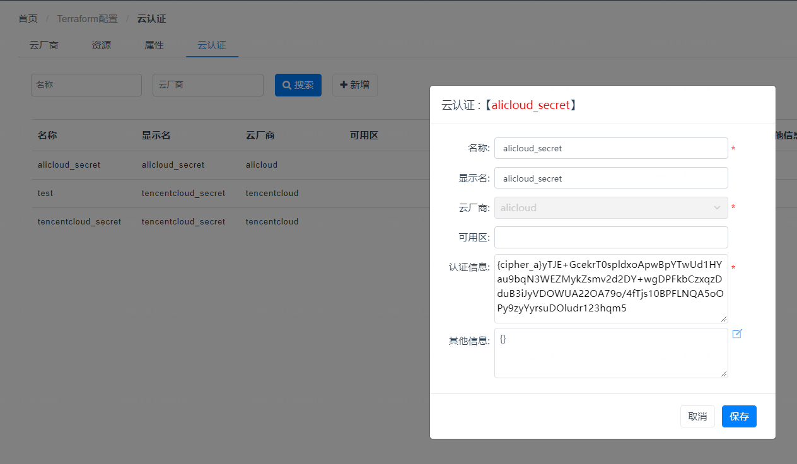
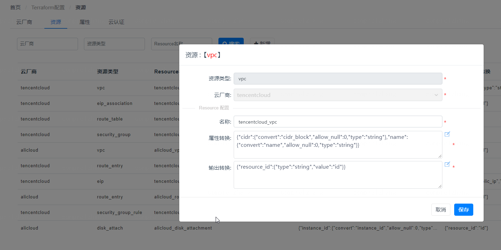
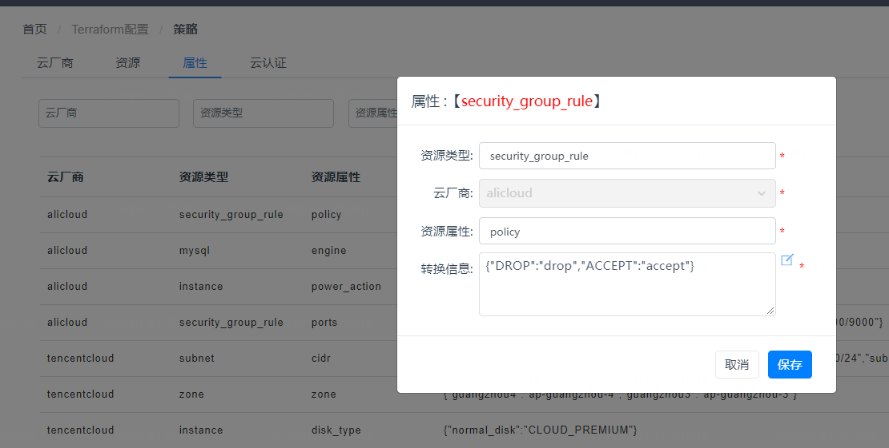

### 配置入口

Terraforrm插件注册后，需要进行一些配置方可管理多云资源

Web配置入口：系统 - > Terraform配置管理       



### Terraform基础

我们在插件初始化时，已经内置部分公有云配置， 您可以直接使用。 若您有其他配置需要可修改对应配置即可。

配置信息基于terraform， 您可以通过[terraform官网](https://www.terraform.io/docs/cli/index.html)进行学习, terraform提供许多可用的[provider](https://registry.terraform.io/)，在插件中进行配置需要您了解对应的provider参数信息


### 参数映射配置规则

本章节描述插件内部定义的一套通用字段映射配置规则，适用于资源配置和属性配置

属性转换规则：

字段属性转换定义说明：

定义类型可为string， 也可为json

1.   string 直接转换为对应的值，如： ｛”cider”: “cidr_block”｝则cidr转换为cidr_block

​    若为空字符串，则不转换， 如 {"cidr": ''}

2. json 定义约束, 类型为json, 字段为：

​     a). type定义类型, 可定义： [string, int, float, json, list] 

​     b). allow_null 是否允许为空， 0 为不允许为空，反之则允许为空

​     c). convert 转换为对应的字段名称， 若不定义，则不转换

​    例如： "name": {"type": "string", "allow_null": 0, "convert": "name"} name字段，定义type为string， 不运行为空， 转换为name

 

输出转换规则：

字段属性转换定义说明：

定义类型可为string， 也可为json

1. string 直接转换为对应的值，如： ｛”cider”: “cidr_block”｝则cidr转换为cidr_block

2. json 定义约束, 类型为json, 字段为：

​     a). type定义类型, 可定义： [string, int, float, json, list] 

​     b). value转换为对应的字段名称， 若不定义，则不转换

​    例如： {"resource_id":{"type":"string","value":"id"}}


>  注： 要求的关键字不使用， 则可使用减号移除， 如：{"tag": "-"}


### 云厂商配置

云厂商对应于terraform provider， 对接新的云厂商需要在插件中进行注册



例如接入腾讯云， provider为： tencentcloud

可以配置转换定义region、secret_id、secret_key进行转换

云厂商对应的认证信息可以则在云认证中进行配置


### 云认证配置

云认证配置云厂商的访问秘钥，访问秘钥在terraform中会以AES方式进行加密存储， 加密后的字段会以{cipher_a}开头标识

可用区提供限制secret key在对应region使用的功能(若无需限制则留空)




### 资源配置

资源配置是对云资源进行配置，具体的资源名称及参数，请参考具体terraform provider的文档

对于资源定义，插件已预定义部分必要字段， 您在配置过程中需要对这些必要字段进行定义，定义方法参考转换参数配置规则章节。

例如vpc在属性转换定义时，插件接口输入参数定义了需要定义cidr， name两个必要字段，而provider A需要cidr_block和name字段

则需要配置映射关系cidr->cidr_block, name->name

插件接口输入参数定义了resource_id，而provider A提供了id字段，则需要配置映射关系resource_id->id




 

### 属性配置

配置值转换，用于同一云参数值， 格式为key-value形式，详细配置规则参见转换参数配置规则章节



 

### 请求示例

配置完成后， 您可创建您注册的云厂商云资源进行管理
例如vpc资源：

```json
POST /terraform/v1/network/backend/vpc/apply
参数：
{
    "inputs":[
        {
            "id":"9154bdbcd3364a48b518f38d15f49b00",
            "asset_id":"vpc-5zync561",
            "resource_id":"vpc-5zync561",
            "name":"vpc-00w",
            "provider":"tencentcloud",
            "region":"guangzhou",
            "secret":"tencentcloud_secret",
            "cidr":"10.0.0.0/16",
            "extend_info":{
                "tags":{
                    "test":"test"
                }
            }
        }
    ]
}
输出：
{
    "resultCode":"0",
    "resultMessage":"success",
    "results":{
        "outputs":[
            {
                "errorCode":"0",
                "errorMessage":"",
                "id":"9154bdbcd3364a48b518f38d15f49b00",
                "callbackParameter":"",
                "resource_id":"vpc-ja8eg8h5"
            }
        ]
    }
}
```

