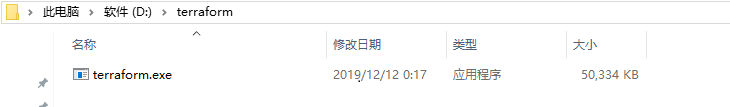
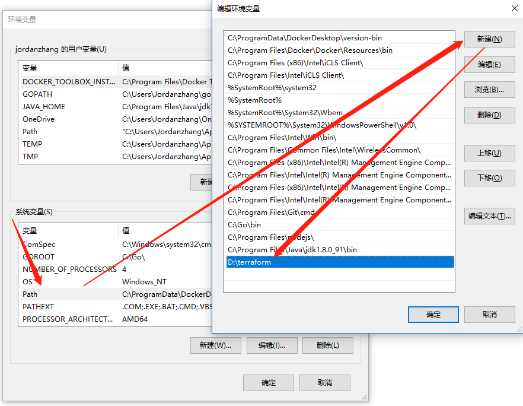
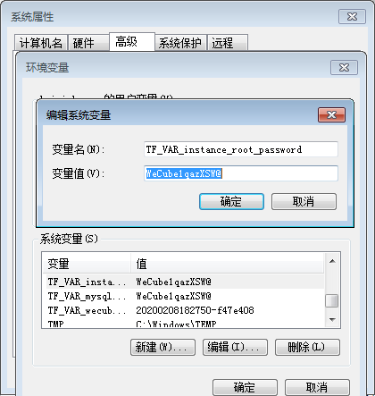
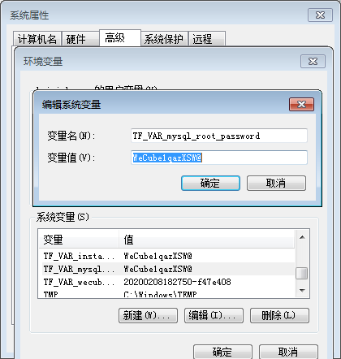
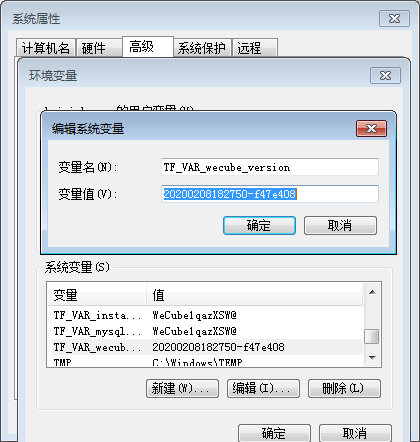
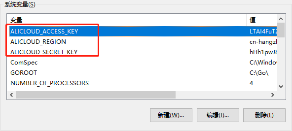
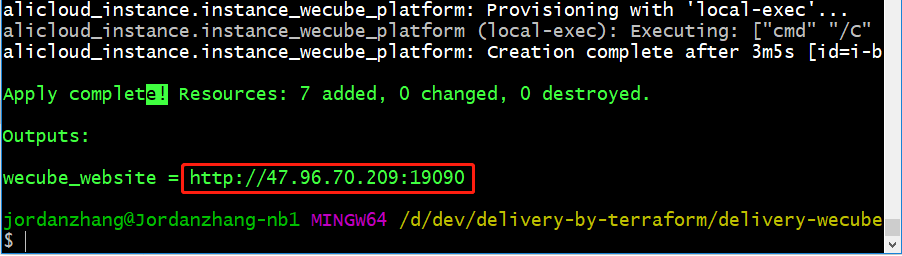
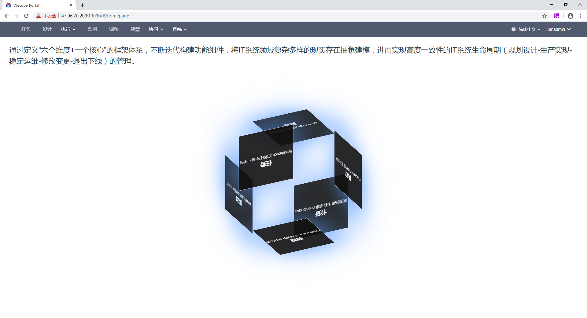
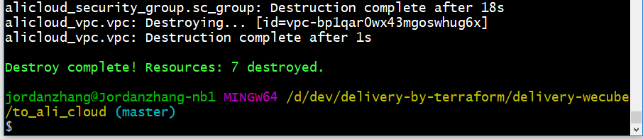
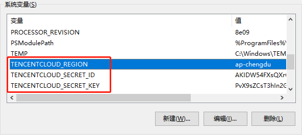

# 在公有云上以单机模式安装WeCube

在这里，我们将为您说明如何使用 [Terraform](https://www.terraform.io/) 在公有云上购买和创建资源、配置网络并在其之上安装以单机模式运行的WeCube。

## 下载 Terraform

官方下载地址:
[https://www.terraform.io/downloads.html](https://www.terraform.io/downloads.html)

!!! note "请根据操作系统类型下载"

	[Windows 64位处理器版本](https://releases.hashicorp.com/terraform/0.12.19/terraform_0.12.19_windows_amd64.zip)  

	[Linux 64位处理器版本](https://releases.hashicorp.com/terraform/0.12.19/terraform_0.12.19_linux_amd64.zip)


## 配置 Terraform (以Windows为例)

### 下载后解压至任一目录（如d:\terraform)
 

### 配置Path，可在任何目录执行terraform


## 下载安装工具代码

``` bash
cd d:\dev
git clone https://github.com/WeBankPartners/delivery-by-terraform.git
```

## 运行Terraform部署WeCube
为方便用户体验，我们提供了单机版和生产版两种部署方案。

### 单机版
单机版目前提供了阿里云和腾讯云两个云服务商的版本。
顾名思义，单机版只需要一台云服务器即可部署WeCube。

部署之前，可以修改下面terraform变量值，否则会使用默认值；

变量名 | 默认值 |  描述  
-|-|-
instance_root_password | WeCube1qazXSW@ | 云主机的root密码 |
mysql_root_password | WeCube1qazXSW@ | mysql数据库的root密码 |
wecube_version | v2.1.1 | wecube的版本 |

也可以通过修改环境变量的方式来设置terraform变量
WeCube主机的密码至环境变量（不改默认为`WeCube1qazXSW@`）：
 

配置mysql的root密码（不改默认为`WeCube1qazXSW@`）：
 

配置wecube的version，即镜像tag（不改默认为`v2.1.1`）：
 

#### 部署到阿里云

##### 配置Access Key/Secret Key至本地环境变量（默认使用region为cn-hangzhou） 

>注意: Access Key/Secret Key是敏感信息，建议配置到本地环境变量，不要配置在Terraform的模板文件\*.tf里

>注意: 若配置的region不为"cn-hangzhou"，则需要相应的修改delivery-by-terraform\delivery-wecube-for-stand-alone\to_ali_cloud\aliyun_wecube.standalone.tf中出现的所有"availability_zone"的值。例如region配置为"cn-shenzhen",availability_zone则需要修改为"cn-shenzhen-a"或者深圳地域下的其他可用区。

##### 初始化Terraform
``` bash
cd d:\dev\delivery-by-terraform\delivery-wecube-for-stand-alone\to_ali_cloud
terraform init    -- 安装阿里云的插件, 需要点时间，因国内网速较慢
```

##### 执行部署(一键部署)
``` bash
cd d:\dev\delivery-by-terraform\delivery-wecube-for-stand-alone\to_ali_cloud
terraform apply   -- 执行部署
.....
Enter a value: yes  -- 确认执行
.....
```

>如果你看到这个，说明已部署成功，拷贝输出的URL至浏览器即可访问Wecube


##### 销毁部署 (一键销毁)
``` bash
cd d:\dev\delivery-by-terraform\delivery-wecube-for-stand-alone\to_ali_cloud
terraform destroy   -- 销毁部署
.....
Enter a value: yes  -- 确认执行
.....
```


#### 部署到腾讯云

##### 配置Access Key/Secret Key至本地环境变量 

>注意: Access Key/Secret Key是敏感信息，建议配置到本地环境变量，不要配置在Terraform的模板文件\*.tf里  
>注意: 若配置的region不为"ap-guangzhou"，则需要相应的修改delivery-by-terraform\delivery-wecube-for-stand-alone\to_tencent_cloud\tencent_wecube.tf中出现的所有"availability_zone"的值。例如region配置为"ap-chengdu",availability_zone则需要修改为"ap-chengdu-1"或成都地域下的其他可用区。

##### 初始化Terraform
``` bash
cd d:\dev\delivery-by-terraform\delivery-wecube-for-stand-alone\to_tencent_cloud
terraform init    -- 安装腾讯云的插件, 需要点时间，因国内网速较慢
```

##### 执行部署(一键部署)
``` bash
cd d:\dev\delivery-by-terraform\delivery-wecube-for-stand-alone\to_ali_cloud
terraform apply   -- 执行部署
.....
Enter a value: yes  -- 确认执行
.....
```

>如果你看到这个，说明已部署成功，拷贝输出的URL至浏览器即可访问Wecube


##### 销毁部署 (一键销毁)
``` bash
cd d:\dev\delivery-by-terraform\delivery-wecube-for-stand-alone\to_ali_cloud
terraform destroy   -- 销毁部署
.....
Enter a value: yes  -- 确认执行
.....
```

